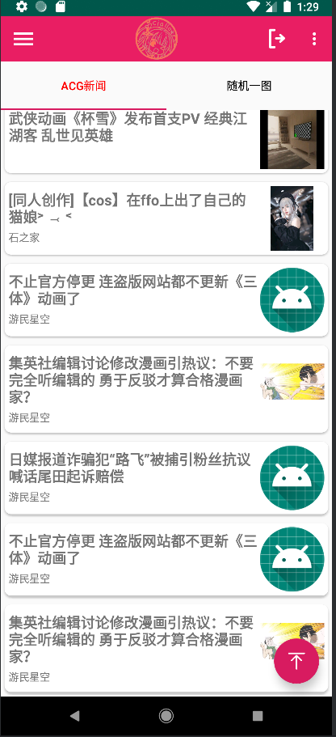

# Android NGA A岛二次元论坛

# 项目开发说明

2025 年 3 月,我再次回顾这个项目,发现后端没加上去.考虑到参与该项目的朋友们大多是为小学期做准备,我在此分享一些开发过程中的关键信息,希望能对你们有所帮助.

在之前的课程设计中,搜索动漫新闻的接口是由后端自行编写的.而随机图片的功能则是基于默认网络开放 API 实现的,具体的来源我已经不太记得了,你们可以自行代码里面查找.至于动漫频道中的内容,均是通过网络 API 获取的.

因此,目前你们的主要任务是补充动漫新闻和用户注册的 API.推荐使用 Node.js 和 Express 框架来快速搭建后端或者熟悉的后端来吧.本地运行后,安卓本地项目是可以连接本地后端的,但需要注意的是,此时的 IP 地址并非默认的 localhost.具体的连接方式,你们可以通过搜索获取详细信息.

数据库的话我把我的动漫文章放到了sql文件夹里面祝你们好运吧.,祝你们开发顺利!


该项目是一个用于浏览NGA论坛的Android应用程序,使用Java开发,并遵循MVVM架构模式.

## 功能特点

- 浏览和查看论坛文章.
- 显示用户个人资料和帖子.
- 在不同的论坛版块间导航.

## 项目结构

项目结构如下:

```
Android_NGA_Forum-master/
├── app/
│   ├── build.gradle
│   ├── proguard-rules.pro
│   └── src/
│       ├── androidTest/
│       │   └── java/
│       │       └── com/example/my_nga_fornums/
│       │           └── ExampleInstrumentedTest.java
│       ├── main/
│       │   ├── AndroidManifest.xml
│       │   ├── assets/
│       │   │   └── litepal.xml
│       │   ├── java/
│       │   │   └── com/example/my_nga_fornums/
│       │   │       ├── Article/
│       │   │       │   └── Article.java
│       │   │       ├── MainActivity.java
│       │   │       └── ...
│       │   ├── res/
│       │   │   ├── layout/
│       │   │   │   └── activity_main.xml
│       │   │   ├── mipmap-anydpi-v26/
│       │   │   ├── mipmap-hdpi/
│       │   │   ├── mipmap-mdpi/
│       │   │   ├── mipmap-xhdpi/
│       │   │   ├── mipmap-xxhdpi/
│       │   │   ├── mipmap-xxxhdpi/
│       │   │   └── values/
│       │   │       ├── colors.xml
│       │   │       ├── strings.xml
│       │   │       └── styles.xml
│       └── test/
│           └── java/
│               └── com/example/my_nga_fornums/
│                   └── ExampleUnitTest.java
├── gradle/
│   ├── libs.versions.toml
│   └── wrapper/
│       ├── gradle-wrapper.jar
│       └── gradle-wrapper.properties
├── .gitignore
├── README.md
├── build.gradle
├── gradle.properties
├── gradlew
├── gradlew.bat
└── settings.gradle
```

## 快速开始

### 先决条件

- Android Studio
- Java Development Kit (JDK) 8 或更高版本

### 安装步骤

1. 克隆该仓库:
    ```bash
    git clone https://github.com/your_username/Android_NGA_Forum.git
    ```
2. 在Android Studio中打开项目.
3. 同步Gradle文件.
4. 在模拟器或物理设备上构建并运行应用程序.

## 使用的库

- [LitePal](https://github.com/LitePalFramework/LitePal) - 一个使开发者使用SQLite数据库极其容易的Android库.
- [Glide](https://github.com/bumptech/glide) - 一个专注于平滑滚动的图片加载和缓存库.
- [Retrofit](https://github.com/square/retrofit) - 一个类型安全的HTTP客户端,适用于Android和Java.

## 贡献

欢迎贡献!请随时提交Pull Request.

## 许可

该项目使用MIT许可证 - 请参阅[LICENSE](LICENSE)文件了解更多详情.

## 致谢

- 感谢开源社区提供的必要工具和库.


## 图片



 
 
